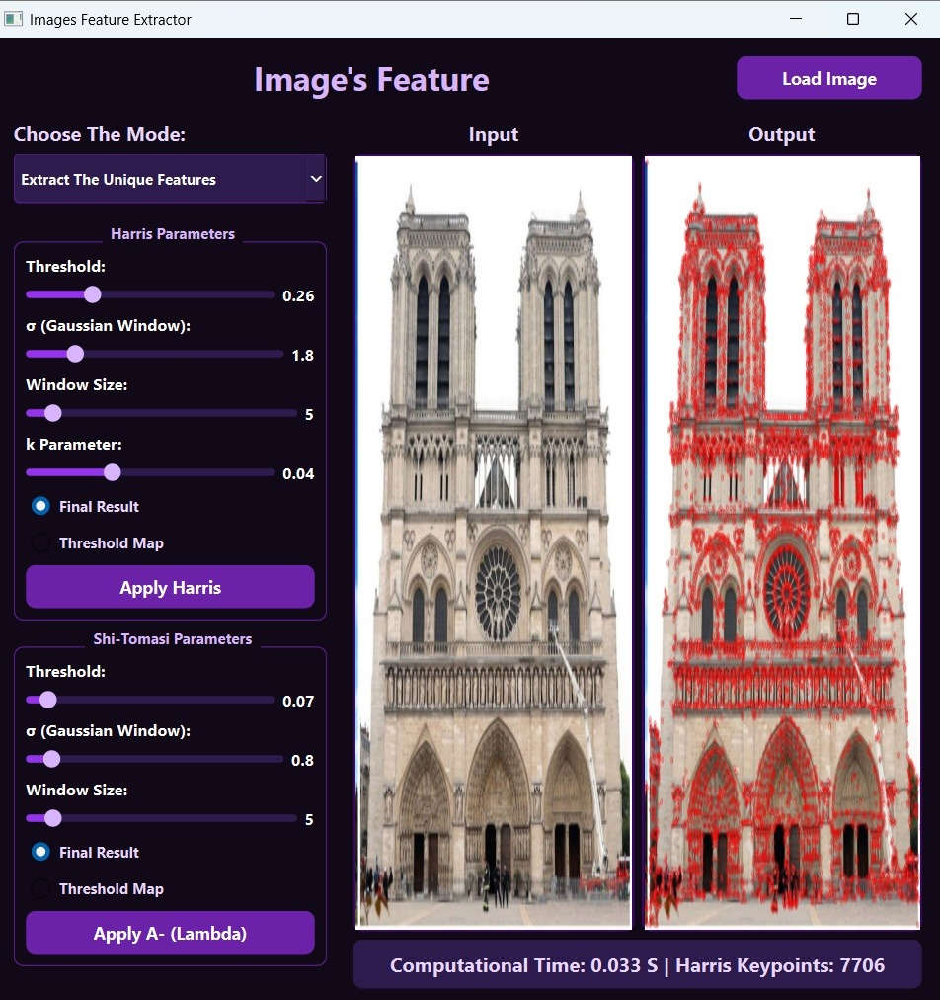
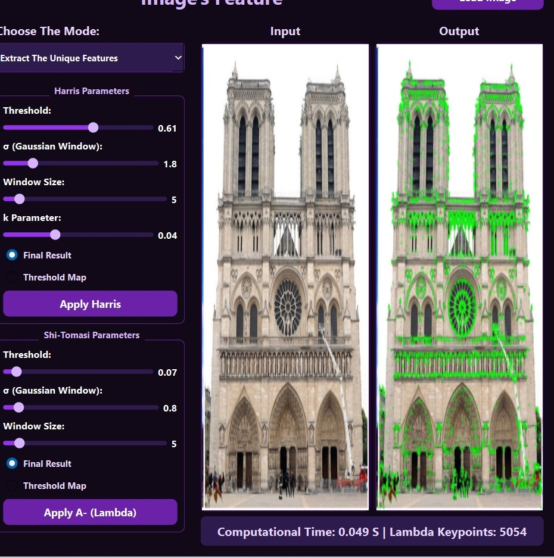
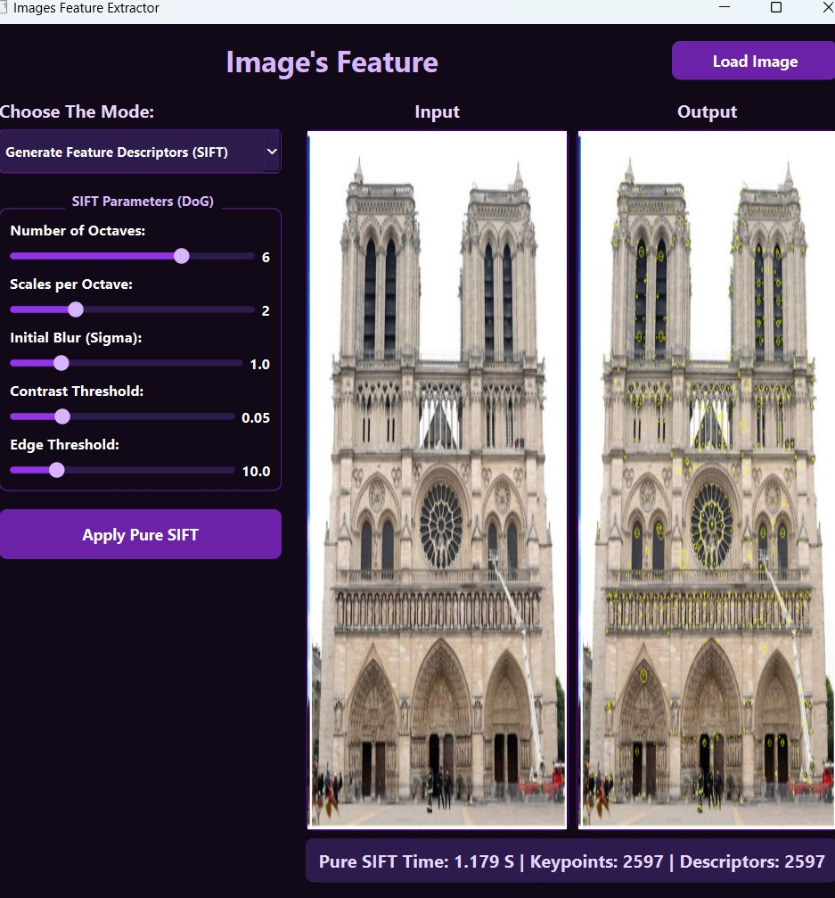

# 👁️ Computer Vision: Feature Extraction & Matching (C++ / Qt)

## 📌 Project Overview
A C++/Qt Computer Vision application for feature extraction (Harris, SIFT) and matching (SSD, NCC) with real-time performance benchmarking. This desktop application evaluates the performance and computation time of fundamental feature detection algorithms, providing a graphical interface for visual analysis and robotics-related tracking tasks.

## ⚙️ Core Capabilities
* **Feature Detection (Harris Operator):** Identifies unique keypoints using the Harris Corner Detector and $\lambda$ eigenvalue analysis.
* **Feature Description (SIFT):** Generates robust, scale-invariant, and rotation-invariant feature descriptors.
* **Feature Matching Metrics:** Matches features between images using:
  * Sum of Squared Differences (SSD)
  * Normalized Cross-Correlation (NCC)
* **Performance Benchmarking:** Real-time reporting of computation times for each algorithmic stage.

---

## 📸 Application Output Gallery

### 1. Harris Corner Detection
Detecting structural corners and unique keypoints using the Harris Operator based on local gradient distribution.

### 2. SIFT Feature Extraction
Extracting robust keypoints and generating scale/rotation-invariant descriptors using the Difference of Gaussians (DoG) pyramid.

### 3. Feature Matching (SSD & NCC)
Establishing correspondences between two different images by matching descriptors. The application highlights matched points and visualizes the connecting vectors.

---

## 🛠️ Tech Stack & Architecture
* **Language:** C++ (Object-Oriented Design)
* **GUI Framework:** Qt (Widgets / UI Designer)
* **Build System:** CMake
* **Architecture:** Modular separation of concerns (Core algorithms separated from GUI logic).

## 🚀 Build & Run Instructions

### Prerequisites
* CMake (Version 3.5 or higher)
* Qt Creator / Qt5 or Qt6 libraries
* C++ Compiler (GCC, Clang, or MSVC)
